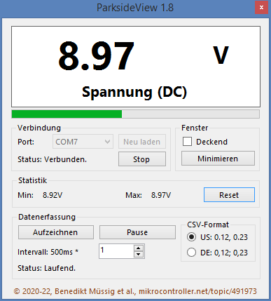

# ParksideView
Ein Programm, um Daten von Parkside PDM-300-C2 Multimetern abzurufen und aufzuzeichnen.

## Übersicht
ParksideView ist ein Hilfsprogramm, das Messdaten in Echtzeit von Parkside PDM-300-C2 und PDM-300-C3 Digitalmultimetern abrufen kann.
Diese Multimeter sind periodisch bei LIDL online und im Laden für ungefähr 13€ verfügbar.

## Funktionen
* Große Echtzeitanzeige des aktuell auf dem Multimeter angezeigten Wertes
* Bargraph-Anzeige in allen unterstützten Modi
* Aufzeichnen der Messdaten in eine CSV-formatierte Datei
* Zurücksetzbare Min/Max-Statistik
* Einstellbare Aufzeichnungsgeschwindigkeiten
* Ausführbar auf Windows 7, 8, 10, 11 und Linux (via Mono: https://www.mono-project.com/)
* Lokalisiert für Deutsch, Englisch und Portugiesisch
* CSV Format zwischen Deutsch und and US/International wählbar
* Automatische Konfiguration der seriellen Schnittstelle
* Synchronisierung zum Datenstrom, guter Umgang mit Fehlern, Ausblenden des Displays bei keinen/ungültigen Daten
* Datenerfassung kann jederzeit angehalten werden (im Normalbetrieb und während einer Aufnahme)
* Der aktuelle Modus wird immer mitaufgezeichnet und kann während einer Aufnahme geändert werden
* Ein Klick auf den aktuellen Wert, kopiert diesen in die Zwischenablage
* Das Fenster kann auf Knopfdruck über allen anderen Fenstern fixiert werden
* Mehrere Instanzen des Programms können gleichzeitig verwendet werden, um mehrere Multimeter abzufragen

## Screenshot

## Hardware
Um die Software nutzen zu können, muss ein kleiner, einfacher Hardwareeingriff am Multimeter durchgeführt werden.
Zwei Litzen müssen an Testpunkten der Multimeterplatine angelötet und nach außen geführt werden.
Diese Litzen können dann z.B. über ein kleines Loch auf der Rückseite des Gehäuses nach draußen geführt werden.

### Vorraussetzungen
* Lötkolben und Lötzinn
* Zange zum Abisolieren und Schneiden
* 28+ AWG / < 0,08mm² Litze (~ 1m)
* USB-Seriell-Wandler (5V mit dem empfohlenen Optokoppler / 3.3V direkt - nicht empfohlen!)
* Optokoppler (https://www.sparkfun.com/products/9118 - *NICHT* für Spannungen > 60V verwenden!)

### Testpunkte
Im folgenden Bild sind die zwei Testpunkte auf der Multimeterplatine erkennbar, mit denen der Optokoppler verbunden wird:

### Löten
Um den Multimeter mit dem PC zu verbinden, muss eine Litze vom TX-Testpunkt des Multimters zum IN1-Pad des Optokopplers verbunden werden.
Dann muss eine weitere Litze vom GND-Testpunkt des Multimeters zum GND-Pad des Optokopplers geführt werden.
Eine weitere Verbindung führt vom HV-Pad des Optokopplers zum 5V Kontakt des USB-Seriell-Wandlers.
Ebenso muss eine Verbindung vom HVG-Pad des Optokopplers zum GND-Pad des USB-Seriell-Wandlers geführt werden.
Letztlich muss das OUT1-Pad des Optokopplers mit dem *RX*-Pad (nicht TX!) des USB-Seriell-Wandlers verbunden werden.

## Verwendung des Multimeters
Nach den Hardware-Modifikationen lässt sich der Multimeter weiterhin normal und ohne PC verwenden.
Jedoch darf der Multimeter *nicht* mehr zum Messen von Spannungen über 60V über PE verwendet werden.
Um den Multimeter am PC zu verwenden, muss nur der USB-Seriell-Wandler eingesteckt werden.
Im Geräte-Manager unter Windows, oder mittels dmesg auf Linux kann der korrekte Port ermittelt werden.
Auf Linux lautet dieser meist /dev/ttyUSB0.

## Teilen
Beim Teilen des Programms, bitte https://github.com/bmuessig/ParksideView oder https://www.mikrocontroller.net/topic/491973 verlinken.

Viel Spaß!
